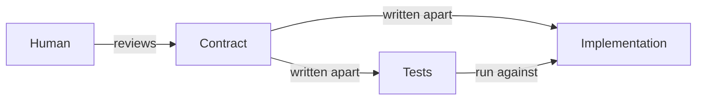

# wip - Code Design

Rules for TypeScript functions in this repository. They let a reader, human or agent, trust a function from its signature and tests and skip its body.

- Follow the order of work when you add a function or change its contract.
- For a bug fix that keeps every contract, skip stage 1 (contract) and stage 2 (tests):
  - Add one test, written from the contract, that fails because of the bug.
  - Then fix the body.
- For existing code without tests, follow every stage; the current behavior is the contract.
  - Write down what callers rely on, not incidental behavior such as invalid inputs.
  - Leave callers on the old code until stage 3 (implementation) replaces it.
  - Run the stage 2 tests against the old code; human accepts each failure as a test fix or a behavior change.
  - When the old code cannot be imported, such as a function inside a CLI script, compare instead:
    - Copy its logic into a script outside the repository.
    - Run the old copy and the new code on the same real inputs, and diff the outputs.
- Paths follow this template, where core functions live in `src/core/`.
  - In another layout, use the directory that the oxlint core override names.
- Each rule section ends with a table of what reports a broken rule.
  - `Review` means no tool does; check it yourself before handing over.

<!-- prettier-ignore -->
```ts
const bmi = (height: HeightMeter, weight: WeightKg): number =>
//    ^^^    ^^^^^^^^^^^^^^^^^^^^^^^^^^^^^^^^^^^^^   ^^^^^^
//    name   parameter names and types               return type
//    └──────────────────── signature ────────────────────┘
  weight / (height * height);
//^^^^^^^^^^^^^^^^^^^^^^^^^^^ body
```

| Term | Meaning |
| --- | --- |
| Contract | The conditions a caller meets and the result the function promises: types, signatures, and JSDoc |
| Branded type | A primitive with a type-only tag, such as `number & { readonly __brand: "Quantity" }` |
| Smart constructor | The only function that creates a branded value; it checks the condition first |
| Core | Pure functions in the core directory, `src/core/` in this template |
| Shell | Code outside the core directory that reads, calls core functions, and writes |

## Order of work

```mermaid
sequenceDiagram
    participant H as Human
    participant A as Agent
    participant M as Checks
    A->>H: Stage 1: contract
    H-->>A: Approve
    A->>H: Stage 2: tests from the contract
    H-->>A: Approve; agent saves the baseline
    A->>M: Stage 3: implementation
    M-->>H: Results
    H->>M: Review and commit
```

Tests for a whole contract come first, in one batch, before any body. This is not test-driven development, which alternates one test and one change.

Stages 1 and 2 end in human approval, not a commit. The pre-commit hook runs the related tests, and stage 2 leaves them failing on purpose.

### Stage 1: contract

- Write branded types, their JSDoc, and their smart constructors in full.
  - Why: the constructor's checks are the invariants.
- Declare every other new exported function without a body.
  - Why: `noUnusedParameters` rejects a stub body that ignores its parameters.
- Keep the body of an existing function whose contract changes; edit only its types and JSDoc.
  - Why: the body still works for the unchanged behavior, and its tests keep passing.
- Write functions that only connect other functions in full.
  - Why: tsc then reports where one result misses the next precondition.
- State each exported function's input-output relation in its JSDoc.
  - Include formulas, rounding, bound behavior, and expected failures.
  - Why: stage 2 writes tests from this text alone.
- Stop and ask the human when a required behavior is unspecified.
- Write only behavior that callers need now; leave hypothetical cases out.
  - Example: same-file types, not namespaces, shadowing, or generic references.
  - Why: each case in the contract becomes tests and code to keep.
- Done when `just typecheck` passes.
- Stop for human review; continue only after approval. Do not commit.

```ts
/**
 * Body mass index: weight in kilograms divided by the square of height in
 * meters, without rounding.
 */
export declare const bmi: (height: HeightMeter, weight: WeightKg) => number;
```

### Stage 2: tests

- Write tests from the contract alone; the bodies do not exist yet.
- Write expected values as literals worked out apart from the code.
  - Example: `toBeCloseTo(22.86, 2)`, not `toBe(70 / (1.75 * 1.75))`.
- Done when `just typecheck` passes and `just test` fails only on the new behavior.
  - A declared function fails with `TypeError: bmi is not a function`.
  - A kept body fails on its new expected values; its other tests pass.
- Stop for human review; continue only after approval. Do not commit.
- After approval, save the baseline that stage 3 (implementation) compares against:
  - Record the tree ID that `GIT_INDEX_FILE="$(mktemp -u)" sh -c 'git add -A && git write-tree'` prints.
  - The command writes Git objects; a sandboxed agent may need approval or the human to run it.
  - Run `pnpm exec tsc --declaration --emitDeclarationOnly --noEmit false --outDir <dir>`, with `<dir>` outside the repository.
  - Why: the tree ID covers untracked test files, and neither step touches the index.

### Stage 3: implementation

- Replace each `declare` and update each kept body until `just test` passes.
- Keep the tests and the contract as they are.
- Stop and report when a test or the contract looks wrong.
  - After the human fixes it in stage 1 (contract) or stage 2 (tests), save a new baseline.
- Done when every check passes:
  - `just test`, `just typecheck`, and `just check`
  - `git diff --name-status <stage 2 tree> <current tree> -- '*.test.ts'` prints nothing
    - Get `<current tree>` with the same `git write-tree` command as in stage 2.
  - The contract emitted again to a new directory matches the stage 2 copy, with `diff -r`
  - `just jev-lint` findings are fixed or answered
  - `just mutation --mutate <changed file>` runs; report surviving mutants instead of adding tests
    - Without `--mutate`, Stryker mutates only `src/` and `lib/`, and takes longer.
- Stop for human review. Commit after approval, with every hook.

| Rule | Check |
| --- | --- |
| Declare functions in stage 1 (contract) | tsc: TS6133 on a stub body that ignores its parameters |
| Contracts connect | tsc: TS2345 in a function that connects others |
| Tests fail only on the new behavior | Vitest: `TypeError: <name> is not a function`, or a changed expected value |
| Stage 3 (implementation) keeps the tests | `git diff --name-status` between the stage 2 tree and the current tree; it shows added, changed, and removed test files |
| Stage 3 (implementation) keeps the contract | `.d.ts` diff: a return type changed to `number` shows |
| The implementation meets the contract | Vitest: `just test`; pre-commit runs `vitest related` on staged files |
| The JSDoc states each relation | Review: stage 2 (tests) cannot start without it |

### Human review

| Part | Human reviews | Why |
| --- | --- | --- |
| Contract: types, signatures, JSDoc | Yes, after stage 1 (contract) | No tool can tell whether a range or relation matches the domain |
| Smart constructor checks | Yes, after stage 1 (contract) | The checks are the invariants |
| Test names, bounds, expected values | Yes, after stage 2 (tests) | A wrong expected value passes every tool |
| Shell function bodies | Yes, after stage 3 (implementation) | Types do not show what a function reads or writes |
| Check results | Yes, after stage 3 (implementation) | Human decides what to do with a finding |
| Core function bodies | No | Tests check the relations, and tsc checks the types |
| Whether stage 3 (implementation) changed tests or the contract | No | The tree diff and `.d.ts` diff show it |
| Style and known mistakes | No | oxlint and jev-lint report them |

## Preconditions

- Give a parameter a domain type when its value has a condition.
- Check the condition once, where the value is created.
- Trust a domain-typed parameter; do not recheck it inside the function.
  - Why: the reader learns the conditions from the signature, not the body.

```ts
/** Height in meters, greater than 0 and at most 3. */
type HeightMeter = number & { readonly __brand: "HeightMeter" };
//   ^^^^^^^^^^^ unit in the type name; range in the JSDoc above

/** Weight in kilograms, greater than 0 and at most 700. */
type WeightKg = number & { readonly __brand: "WeightKg" };

const bmi = (height: HeightMeter, weight: WeightKg): number =>
  weight / (height * height);

bmi(weight, height); // Type error: a WeightKg is not a HeightMeter.
```

| Rule | Check |
| --- | --- |
| Parameters that share a primitive are not mixed up | tsc: TS2345 on `bmi(weight, height)` |
| Give lookalike parameters domain types | jev-lint: `unbranded-lookalike-params` |
| Do not recheck a domain-typed parameter | jev-lint: `redundant-internal-validation` |
| Give a domain type to a parameter with a condition | Review: the domain decides which conditions matter |

## Invariants

```text
number ──▶ quantity() ──▶ Quantity
           │ checks for an integer from 1 to 20
           └─ throws RangeError otherwise

Quantity + Quantity ──▶ number ──▶ quantity() ──▶ Quantity
                        brand lost   checked again
```

- Create a branded value only in its smart constructor.
- Pass the result of an operation on branded values through the constructor again.
  - Why: `15 + 10` is a plain `number`, and only the constructor can reject 25.
- Mark every field of an object type `readonly`.
- Throw from the constructor when code inside the program passes a bad value.
- Parse external input once at the boundary, and return failure as a value.

```ts
/** Order quantity, an integer from 1 to 20. */
type Quantity = number & { readonly __brand: "Quantity" };

const quantity = (value: number): Quantity => {
  if (!Number.isInteger(value) || value < 1 || value > 20) {
    throw new RangeError("Quantity must be an integer from 1 to 20.");
  }
  // SAFETY: the check above enforces the Quantity invariant.
  // oxlint-disable-next-line typescript/no-unsafe-type-assertion
  return value as Quantity;
};

const add = (a: Quantity, b: Quantity): Quantity => quantity(a + b);
```

| Rule | Check |
| --- | --- |
| Create a branded value only in its smart constructor | oxlint: `typescript/no-unsafe-type-assertion` on `as Quantity` |
| State the checked invariant at the assertion | oxlint: `anti-slop/require-safety-comment-for-type-assertion` |
| Pass an operation's result through the constructor | tsc: TS2322 on `(a, b): Quantity => a + b` |
| Do not write to a `readonly` field | tsc: TS2540 |
| Mark every field `readonly` | Review: no rule reports a mutable field |
| Throw for bugs; parse external input at the boundary | Review: the code path decides whether input is external |

If jev-lint's `suppression-hides-correctness` flags the constructor's suppression, answer yes only when no check above it enforces the invariant.

## How far to type a value

| Level | Form | Guarantees | Use for |
| --- | --- | --- | --- |
| 1 | `heightMeter: number` | Nothing; the name only states the unit | Values local to a function, intermediate results |
| 2 | Branded type | Unit, no mix-ups | Parameters that share a primitive type |
| 3 | Branded type with a smart constructor | Unit, no mix-ups, range | Domain values passed between functions or modules |
| 4 | A type per unit with conversions | Conversions between units | Inputs that mix units, such as meters and centimeters |

- Put the unit in the type name, such as `HeightMeter`.
- Put the range and other conditions in the type's JSDoc, once.
- Stop at level 3 for domain values.
- Create a level 2 value in a constructor that accepts every value of the primitive.
  - Say so in the type's JSDoc, as in `Every string is allowed.`
  - jev-lint's `suppression-hides-correctness` may flag its cast; answer no when the JSDoc allows every value.
- Move to level 4 only when two units occur in the code.
- Keep a return type as `number` until another function takes it as input.

| Rule | Check |
| --- | --- |
| Every rule in this section | Review: where the value travels decides the level |

## Postconditions

```ts
const total = (a: Quantity, b: Quantity): Quantity => quantity(a + b);
//                                        ^^^^^^^^ promises 1 to 20, not that it can throw
const findUser = (id: UserId): User | undefined => users.get(id);
//                             ^^^^^^^^^^^^^^^^ promises that a user can be missing
```

- Promise the kind and range of a result in the return type.
- Return an expected failure as a value, such as `User | undefined`.
- Throw only for a bug inside the program.
  - Why: a signature does not show that a function throws.
- Leave arguments unchanged in every function.
- In core functions, return new values without changing outside state.
- In shell functions, state the reads, writes, and expected failures in the JSDoc.

| Rule | Check |
| --- | --- |
| Promise the kind and range in the return type | tsc: TS2345 on `order(total(a, b))` when `total` returns `number` |
| Handle an expected failure | tsc: TS2345 on `greet(findUser(id))` with `User \| undefined` |
| Do not change arguments | oxlint: `no-param-reassign` with `props: true` |
| No outside state changes in core functions | Review; jev-lint candidates: `query-name-with-side-effects`, `shared-mutable-module-state` |
| Shell JSDoc states reads, writes, and failures | Review in stage 1 (contract) |
| Throw only for a bug inside the program | Review: the domain decides whether a failure is expected |

## Where the contract lives

| Promise | Place |
| --- | --- |
| Unit and range | The type name and the type's JSDoc |
| Input-output relation: formula, rounding, bounds, failures | JSDoc, written in stage 1 (contract) |
| Meaning, reasons, outside constraints | JSDoc |
| Checks that the relation holds | Tests: examples and properties |
| Steps that compute the relation | The function body |

- State the required relation in JSDoc, even when a short expression computes it.
- Leave implementation steps and local variables out of JSDoc.
- Give a non-exported helper a comment only for a reason the code cannot show.
  - Why: its caller is in the same file, so the code is the contract.
  - Why: the relation is what tests check; steps drift from the body as it changes.
- Write an example as a concrete input and output.
- Write a relation that holds for every input as a property test.

| Rule | Check |
| --- | --- |
| Leave implementation steps out of JSDoc | jev-lint: `comment-narrates-code` |
| JSDoc matches the code | Review; jev-lint candidate: `comment-contradicts-code` |
| Examples are concrete; relations are property tests | Review in stage 2 (tests) |

## Side effects

```text
shell: reads, calls core functions, writes
├── read   db.findStay(id), new Date()
├── call   serviceCharge(price), consumptionTax(price, charge)
└── write  db.saveStay(...)

core: pure functions in src/core/
└── same arguments, same result; nothing else changes
```

- Put calculations in pure functions under `src/core/`.
  - Pure: the result depends only on the arguments, and the function changes nothing.
- Keep I/O, the clock, and randomness in the shell, outside `src/core/`.
- Pass the time and random values into core functions as arguments.
  - Why: a hidden input gives different results for the same arguments.
- Keep a shell function to reading, calling core functions, and writing.
  - Why: human reads shell bodies, because types do not show what a function reads or writes.

```ts
// src/core/charge.ts
/** 15% of the price, rounded down to the yen. */
export const serviceCharge = (price: Yen): Yen => yen(Math.floor(price * 0.15));
/** 10% of the price plus the service charge, rounded down to the yen. */
export const consumptionTax = (price: Yen, charge: Yen): Yen =>
  yen(Math.floor((price + charge) * 0.1));

// src/shell/settle.ts
/**
 * Reads the stay, then saves it with the service charge and tax added to its
 * price. Rejects when the stay is missing or the save fails.
 */
export const settle = async (db: Db, id: StayId): Promise<void> => {
  const stay = await db.findStay(id);
  const charge = serviceCharge(stay.price);
  const tax = consumptionTax(stay.price, charge);
  await db.saveStay({ ...stay, price: yen(stay.price + charge + tax) });
};
```

`oxlint.config.ts` applies these rules to `src/core/**` only:

```ts
overrides: [
  {
    files: ["src/core/**"],
    rules: {
      "no-restricted-globals": [
        "error",
        { message: "Pass the time in as an argument.", name: "Date" },
        { message: "Do I/O outside src/core.", name: "fetch" },
      ],
      "no-restricted-imports": [
        "error",
        { patterns: [{ group: ["node:*"], message: "Do I/O outside src/core." }] },
      ],
      "no-restricted-properties": [
        "error",
        { message: "Pass random values in as arguments.", object: "Math", property: "random" },
      ],
    },
  },
],
```

| Rule | Check |
| --- | --- |
| No Node I/O in core | oxlint: `no-restricted-imports` on `node:*` |
| No network in core | oxlint: `no-restricted-globals` on `fetch` |
| No clock in core | oxlint: `no-restricted-globals` on `Date.now()` and `new Date()`; `Date` as a type passes |
| No randomness in core | oxlint: `no-restricted-properties` on `Math.random()` |
| No I/O libraries in core | oxlint: add the package name, such as `pg`, to `no-restricted-imports` |
| No module state changes in core | Review: oxlint reports nothing for `count += 1`; jev-lint candidate: `shared-mutable-module-state` |
| No hidden clock or randomness outside core | Review; jev-lint candidate: `hard-wired-nondeterminism` |
| A shell function only reads, calls, and writes | Review: human reads shell bodies |

## Abstraction

```text
total = yen(dataCharge(usage) + callCharge(duration) + smsCharge(count))
            └── each name stands for a calculation the reader trusts
                without reading it: a contract, tests, and no side effects
```

- Give a calculation with its own rule a named function and a contract.
  - Example: calls cost 10 yen a minute up to 5 minutes, then 22 yen a minute.
- Keep the caller to combining named results.
- Extract a function only when it is worth a contract and tests.
  - Why: agents tend to extract one-line and single-use functions, which add places to read.
- Do not extract a function that only forwards its arguments to one call.

```ts
/** 10 yen a minute for the first 5 minutes, then 22 yen a minute. */
export const callCharge = (duration: Minutes): Yen =>
  yen(duration <= 5 ? duration * 10 : 50 + (duration - 5) * 22);

const total: Yen = yen(
  dataCharge(usage) + callCharge(duration) + smsCharge(count)
);
```

| Rule | Check |
| --- | --- |
| Do not extract a function that only forwards its arguments | jev-lint: `pass-through-wrapper` |
| A calculation is worth a contract and tests | Review: the domain decides which rules stand alone |
| Do not abstract for one use and no present need | Review; jev-lint candidate: `speculative-abstraction` |
| An extracted function adds clarity, not indirection | Review; jev-lint candidate: `load-transfer-extraction` |
| A function does not mix calculations | Review: `complexity/complexity` misses it; jev-lint candidate: `multiple-responsibilities` |

## Tests



- Write tests from the contract, without reading the implementation.
  - Why: tests read from code copy its bugs, such as a `value >= 20` that rejects 20.
  - No tool catches a copied bound; only writing tests from the contract prevents it.
- Put `x.test.ts` next to `x.ts`, import the function, and name `describe` after it.
  - Why: a reader finds the tests beside the code, and `vitest related` finds them by import.
- Link tests through imports only, not through `@see` in JSDoc.

```text
   0      1 ──────────── 20      21
   ✗      ✓              ✓       ✗
outside  inside        inside  outside
```

- Test each range just inside and just outside its bounds.
- Test ranges only in the smart constructor.
  - Why: functions that take the branded type cannot receive an out-of-range value.
- Test an operation on branded values at the bounds of its result.

```ts
describe("quantity", () => {
  test.each([1, 20])("accepts %d", (value) => {
    expect(quantity(value)).toBe(value);
  });

  test.each([0, 21, 1.5])("rejects %d", (value) => {
    expect(() => quantity(value)).toThrow(RangeError);
  });
});

describe("add", () => {
  test("accepts a sum of 20", () => {
    expect(add(quantity(10), quantity(10))).toBe(20);
  });

  test("rejects a sum of 21", () => {
    expect(() => add(quantity(10), quantity(11))).toThrow(RangeError);
  });
});
```

| Rule | Check |
| --- | --- |
| Do not compute expected values with the code under test | jev-lint: `test-self-referential` |
| Tests cover each bound | Stryker: `just mutation` reports `value < 1` → `value <= 1` as survived |
| Tests do not copy a wrong bound from the code | Review: the copied test looks correct |
| Test ranges only in the smart constructor | Review |
| `x.test.ts` sits next to `x.ts` and links by import | Review |

Stryker counts example tests only. A property test's name carries its seed, so a mutant that only property tests cover shows as survived.

## Ideas

Not instructions; candidates for later.

- A contract index: list every signature, branded type, and JSDoc in one view.
  - Human could review contracts there without opening each file.
  - The `.d.ts` that tsc emits may already be this index.
- A lock for stage 3 (implementation): stop an agent from loosening the tests or the contract.
  - It could reject edits to `*.test.ts` and any change to the `.d.ts` until stage 3 (implementation) ends.

## References

- [設計次第でAIコードの読む量は減らせる / designing-for-code-reading](https://speakerdeck.com/minodriven/designing-for-code-reading)
