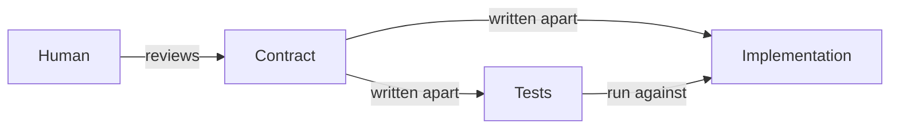
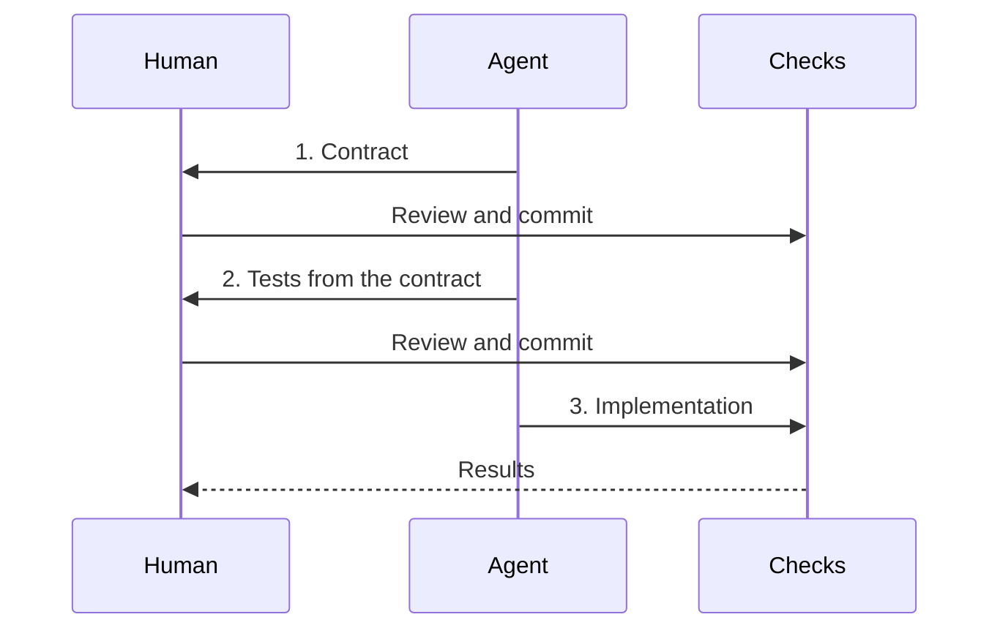

# Code Design

Design code so that a reader can trust a function from its signature and skip its body.

<!-- prettier-ignore -->
```ts
const bmi = (height: HeightMeter, weight: WeightKg): number =>
//    ^^^    ^^^^^^^^^^^^^^^^^^^^^^^^^^^^^^^^^^^^^   ^^^^^^
//    name   parameter names and types               return type
//    └──────────────────── signature ────────────────────┘
  weight / (height * height);
//^^^^^^^^^^^^^^^^^^^^^^^^^^^ body
```

- Signature: a function's name, parameter names and types, and return type
- Contract: the conditions a caller meets and the result the function promises

Each section ends with a table of how its rules are checked. Verified: tried in this template, or in a scratch project for tools this template lacks. Unverified: expected, not yet tried. Candidate: a jev-lint candidate rule.

## Preconditions

- Give a parameter a domain type when its value has a condition.
- Check the condition once, where the value is created.
- Do not recheck a domain-typed parameter inside the function.

```ts
/** Height in meters, greater than 0 and at most 3. */
type HeightMeter = number & { readonly __brand: "HeightMeter" };
//   ^^^^^^^^^^^ unit in the type name; range in the JSDoc above

/** Weight in kilograms, greater than 0 and at most 700. */
type WeightKg = number & { readonly __brand: "WeightKg" };

const bmi = (height: HeightMeter, weight: WeightKg): number =>
  weight / (height * height);

bmi(weight, height); // Type error: a WeightKg is not a HeightMeter.
```

- Why: the reader learns the conditions from the signature, not the body.

| Rule | Checked by | Status |
| --- | --- | --- |
| Parameters that share a primitive type are not mixed up | tsc: TS2345 on `bmi(weight, height)` | Verified |
| Give lookalike parameters domain types | jev-lint (existing): `unbranded-lookalike-params` | In jev-lint |
| Check once; do not recheck a domain-typed parameter | jev-lint (existing): `redundant-internal-validation` | In jev-lint |
| Give a parameter a domain type when its value has a condition | Human: the domain decides which conditions matter | — |

## Invariants

```text
number ──▶ quantity() ──▶ Quantity
           │ checks for an integer from 1 to 20
           └─ throws RangeError otherwise

Quantity + Quantity ──▶ number ──▶ quantity() ──▶ Quantity
                        brand lost   checked again
```

- Create a branded value only in its smart constructor.
- Pass the result of an operation on branded values through the constructor again.
- Mark every field of an object type `readonly`.
- Throw from the constructor when code inside the program passes a bad value.
- Parse external input once at the boundary and return failure as a value.

```ts
/** Order quantity, an integer from 1 to 20. */
type Quantity = number & { readonly __brand: "Quantity" };

const quantity = (value: number): Quantity => {
  if (!Number.isInteger(value) || value < 1 || value > 20) {
    throw new RangeError("Quantity must be an integer from 1 to 20.");
  }
  // SAFETY: the check above enforces the Quantity invariant.
  // oxlint-disable-next-line typescript/no-unsafe-type-assertion
  return value as Quantity;
};

const add = (a: Quantity, b: Quantity): Quantity => quantity(a + b);
```

- Why: oxlint rejects `as Quantity` outside the constructor, so every `Quantity` passed the check.
- Why: `15 + 10` is a plain `number`, and only the constructor can reject 25.

| Rule | Checked by | Status |
| --- | --- | --- |
| Create a branded value only in its smart constructor | oxlint: `typescript/no-unsafe-type-assertion` on `as Quantity` | Verified |
| State the checked invariant at the assertion | oxlint: `anti-slop/require-safety-comment-for-type-assertion` | Verified |
| Pass the result of an operation through the constructor | tsc: TS2322 on `(a, b): Quantity => a + b` | Verified |
| Do not write to a `readonly` field | tsc: TS2540 | Verified |
| Mark every field `readonly` | Human: the current oxlint config does not report a mutable field | — |
| The constructor's suppression is allowed | jev-lint (existing): `suppression-hides-correctness` marks it unsure at about 0.89, so the agent judges it; jev-lint's eval keeps this case | Verified |
| Throw for bugs; parse external input at the boundary | Human: the code path decides whether input is external | — |

## Postconditions

```ts
const total = (a: Quantity, b: Quantity): Quantity => quantity(a + b);
//                                        ^^^^^^^^ promises 1 to 20, not that it can throw
const findUser = (id: UserId): User | undefined => users.get(id);
//                             ^^^^^^^^^^^^^^^^ promises that a user can be missing
```

- Promise the kind and range of a result in the return type.
- Return an expected failure as a value, such as `User | undefined`.
- Throw only for a bug inside the program.
  - Why: a signature does not show that a function throws.
- Do not change arguments or state outside the function.

| Rule | Checked by | Status |
| --- | --- | --- |
| Promise the kind and range of a result in the return type | tsc: TS2345 on `order(total(a, b))` when `total` returns `number` | Verified |
| Handle an expected failure | tsc: TS2345 on `greet(findUser(id))` with `User \| undefined` | Verified |
| Do not change arguments | oxlint: `no-param-reassign` with `props: true` reports `stay.price += 1`; this template enables it | Verified |
| Do not change state outside the function | jev-lint (candidate): `query-name-with-side-effects`, `shared-mutable-module-state` | Candidate |
| Throw only for a bug inside the program | Human: the domain decides whether a failure is expected | — |

## Where the contract lives

| Promise | Place |
| --- | --- |
| Unit and range | The type name and the type's JSDoc |
| A relation that a short expression shows | The function body |
| A relation that the body does not show | Tests: examples and properties |
| Meaning, reasons, outside constraints | JSDoc |

- Do not restate the body in JSDoc.
  - Why: prose drifts from code, and people and agents read it differently.
- Write an example as a concrete input and output.
- Write a relation that holds for every input as a property test.

| Rule | Checked by | Status |
| --- | --- | --- |
| Do not restate the body in JSDoc | jev-lint (existing): `comment-narrates-code` | In jev-lint |
| JSDoc matches the code | jev-lint (candidate): `comment-contradicts-code` | Candidate |
| Examples are concrete; relations are property tests | Human: in stage 2 | — |

## Linking code to tests

```text
src/core/
├── bmi.ts        export const bmi = ...
└── bmi.test.ts   import { bmi } from "./bmi.ts"
                  describe("bmi", ...)
```

- Put `x.test.ts` next to `x.ts`.
- Import the function under test, and name the `describe` block after it.
- Do not link tests from JSDoc, such as with `@see`.
  - Why: nothing checks the link, so it goes stale.

| Rule | Checked by | Status |
| --- | --- | --- |
| Put `x.test.ts` next to `x.ts` | Human: no rule checks file placement yet | — |
| The tests for a file can be found from it | Vitest: `vitest related src/core/bmi.ts --run` runs only the tests that import it, directly or through other files | Verified |
| Import the function and name the `describe` block after it | Human: no rule checks it yet | — |
| Do not link tests from JSDoc | Human: no rule checks it yet | — |

## Tests from the contract



- Have human review the contract: types, signatures, and JSDoc.
- Write tests from the contract, without reading the implementation.
- Write the implementation from the contract, without changing the tests.
  - Why: human catches a wrong contract; tests and code written apart catch a wrong implementation.
  - Why: tests written from the implementation copy its bugs.
  - Example: the code rejects 20 with `value >= 20`, and a test read from it expects 20 to throw.
  - jev-lint's `test-self-referential` flags one form: an expected value computed by the code under test.
  - No tool flags the example above; only writing tests from the contract prevents it.

```text
   0      1 ──────────── 20      21
   ✗      ✓              ✓       ✗
outside  inside        inside  outside
```

- Test each range just inside and just outside its bounds.
- Test ranges only in the smart constructor.
  - Why: functions that take the branded type cannot receive an out-of-range value.
- Test an operation on branded values at the bounds of its result.

| Rule | Checked by | Status |
| --- | --- | --- |
| Tests come from the contract, not the implementation | Stage 1 declares functions, so there is no body to read | Verified: `declare` passes tsc and oxlint |
| Do not compute expected values with the code under test | jev-lint (existing): `test-self-referential` | In jev-lint |
| Tests cover each bound | Stryker with the Vitest runner: `value < 1` → `value <= 1` survives tests without bounds; boundary tests kill it; Stryker counts only example tests, because a property test's name changes with its seed | Verified |
| Tests do not copy a wrong bound from the code | Human: the copied test looks correct | — |
| Test ranges only in the smart constructor | Human: no rule checks it | — |

```ts
describe("quantity", () => {
  test.each([1, 20])("accepts %d", (value) => {
    expect(quantity(value)).toBe(value);
  });

  test.each([0, 21, 1.5])("rejects %d", (value) => {
    expect(() => quantity(value)).toThrow(RangeError);
  });
});

describe("add", () => {
  test("accepts a sum of 20", () => {
    expect(add(quantity(10), quantity(10))).toBe(20);
  });

  test("rejects a sum of 21", () => {
    expect(() => add(quantity(10), quantity(11))).toThrow(RangeError);
  });
});
```

## How far to type a value

| Level | Form | Guarantees | Use for |
| --- | --- | --- | --- |
| 1 | `heightMeter: number` | Nothing; the name only states the unit | Values local to a function, intermediate results |
| 2 | Branded type | Unit, no mix-ups | Parameters that share a primitive type |
| 3 | Branded type with a smart constructor | Unit, no mix-ups, range | Domain values passed between functions or modules |
| 4 | A type per unit with conversions | Conversions between units | Inputs that mix units, such as meters and centimeters |

- Put the unit in the type name, such as `HeightMeter`.
- Put the range and other conditions in the type's JSDoc, once.
- Stop at level 3 for domain values.
- Move to level 4 only when two units occur in the code.
- Keep a return type as `number` until another function takes it as input.

| Rule | Checked by | Status |
| --- | --- | --- |
| Every rule in this section | Human: where the value travels decides the level | — |

## Order of work



### 1. Contract

- Write branded types and their JSDoc.
- Write smart constructors in full.
  - Why: their checks are the invariants.
- Declare every other exported function without a body.
  - Why: `noUnusedParameters` rejects a stub body that ignores its parameters.
- Write functions that only connect other functions in full.
  - Why: tsc then reports where one result does not meet the next precondition.

```ts
/** Body mass index. */
export declare const bmi: (height: HeightMeter, weight: WeightKg) => number;
```

### 2. Tests

- Write tests from the contract alone.
- Write expected values as literals worked out apart from the code.
  - Example: `toBeCloseTo(22.86, 2)`, not `toBe(70 / (1.75 * 1.75))`.
- Confirm that tsc passes, so the tests match the contract.
- Confirm that the tests fail only because a declared export is missing.
  - Vitest reports `TypeError: bmi is not a function` in each test that calls it.

### 3. Implementation

- Replace each `declare` with an implementation until the tests pass.
- Do not change the tests or the contract.
- Stop and report when a test or the contract looks wrong.
  - Human fixes it in stage 1 or 2, reviews it again, and commits it.

| Rule | Checked by | Status |
| --- | --- | --- |
| Declare functions in stage 1 | tsc: TS6133 from `noUnusedParameters` on a stub body | Verified |
| Contracts connect in stage 1 | tsc: TS2345 on functions that connect others | Verified |
| Tests fail only because an export is missing | Vitest: `TypeError: bmi is not a function` in each test; Node: `does not provide an export named 'bmi'` | Verified |
| Stage 3 keeps the contract | `tsc --declaration --emitDeclarationOnly --noEmit false --rootDir src --outDir <dir>`, then diff the `.d.ts` files | Verified: a `declare` and its implementation emit the same `.d.ts`; a return type changed to `number` shows |
| Stage 3 keeps the tests | `git diff <stage 2 commit> -- '*.test.ts'` is empty; it also lists test files added later | Verified |
| The implementation meets the contract | Vitest: `vitest run` passes; the pre-commit hook runs `vitest related` on staged files | Verified |

## Side effects

```text
shell: reads, calls core functions, writes
├── read   db.findStay(id), new Date()
├── call   serviceCharge(price), consumptionTax(price, charge)
└── write  db.saveStay(...)

core: pure functions in src/core/
└── same arguments, same result; nothing else changes
```

- Put calculations in pure functions under `src/core/`.
  - Pure: the result depends only on the arguments, and the function changes nothing.
- Keep I/O, the clock, and randomness in the shell, outside `src/core/`.
- Pass the time and random values into core functions as arguments.
  - Why: a hidden input gives different results for the same arguments.
- Keep a shell function to reading, calling core functions, and writing.
  - Why: human reads shell bodies, because types do not show what a function reads or writes.

```ts
// src/core/charge.ts
export const serviceCharge = (price: Yen): Yen => yen(Math.floor(price * 0.15));
export const consumptionTax = (price: Yen, charge: Yen): Yen =>
  yen(Math.floor((price + charge) * 0.1));

// src/shell/settle.ts
export const settle = async (db: Db, id: StayId): Promise<void> => {
  const stay = await db.findStay(id);
  const charge = serviceCharge(stay.price);
  const tax = consumptionTax(stay.price, charge);
  await db.saveStay({ ...stay, price: yen(stay.price + tax) });
};
```

```ts
// oxlint.config.ts
overrides: [
  {
    files: ["src/core/**"],
    rules: {
      "no-restricted-globals": [
        "error",
        { message: "Pass the time in as an argument.", name: "Date" },
        { message: "Do I/O outside src/core.", name: "fetch" },
      ],
      "no-restricted-imports": [
        "error",
        { patterns: [{ group: ["node:*"], message: "Do I/O outside src/core." }] },
      ],
      "no-restricted-properties": [
        "error",
        { message: "Pass random values in as arguments.", object: "Math", property: "random" },
      ],
    },
  },
],
```

| Rule | Checked by | Status |
| --- | --- | --- |
| Core rules apply only under `src/core/` | oxlint: `overrides` with `files: ["src/core/**"]`; a shell file is not reported | Verified |
| No Node I/O in core | oxlint: `no-restricted-imports` on `node:fs` | Verified |
| No network in core | oxlint: `no-restricted-globals` on `fetch` | Verified |
| No clock in core | oxlint: `no-restricted-globals` on `Date.now()` and `new Date()`; `Date` as a type passes | Verified |
| No randomness in core | oxlint: `no-restricted-properties` on `Math.random()` | Verified |
| No I/O libraries in core | oxlint: add their package names to `no-restricted-imports`, such as `pg` | Verified |
| No module state changes in core | jev-lint (candidate): `shared-mutable-module-state`; oxlint reports nothing for `count += 1` | Candidate |
| No hidden clock or randomness elsewhere | jev-lint (candidate): `hard-wired-nondeterminism` | Candidate |
| A shell function only reads, calls, and writes | Human: reads shell bodies | — |

## Abstraction

```text
total = dataCharge(usage) + callCharge(duration) + smsCharge(count)
        └── each name stands for a calculation the reader trusts
            without reading it: a contract, tests, and no side effects
```

- Give a calculation with its own rule a named function and a contract.
  - Example: calls cost 10 yen a minute up to 5 minutes, then 22 yen a minute.
- Keep the caller to combining named results.
- Extract a function only when it is worth a contract and tests.
  - Why: agents tend to extract one-line and single-use functions, which add places to read.
- Do not extract a function that only forwards its arguments to one call.

```ts
export const callCharge = (duration: Minutes): Yen =>
  yen(duration <= 5 ? duration * 10 : 50 + (duration - 5) * 22);

const total = dataCharge(usage) + callCharge(duration) + smsCharge(count);
```

| Rule | Checked by | Status |
| --- | --- | --- |
| Do not extract a function that only forwards its arguments | jev-lint (existing): `pass-through-wrapper` | In jev-lint |
| Do not add an abstraction with one use and no present need | jev-lint (candidate): `speculative-abstraction` | Candidate |
| An extracted function adds clarity, not indirection | jev-lint (candidate): `load-transfer-extraction` | Candidate |
| A function does not mix calculations that change for different reasons | jev-lint (candidate): `multiple-responsibilities` | Candidate |
| A function does not mix calculations | oxlint: `complexity/complexity` does not report the mixed phone bill calculation | Verified: not reported |
| A calculation is worth a contract and tests | Human: the domain decides which rules stand alone | — |

## What human reviews

| Part | Review | Why |
| --- | --- | --- |
| Contract: types, signatures, JSDoc | Yes, in stage 1 | No tool can tell whether a range or a relation matches the domain |
| Smart constructor checks | Yes, in stage 1 | The checks are the invariants |
| Test names, boundaries, expected values | Yes, in stage 2 | A wrong expected value passes every tool |
| Core function bodies | No | Tests check the relations, and tsc checks the types |
| Shell function bodies | Yes, after stage 3 | Types do not show what a function reads or writes |
| Whether stage 3 changed tests | No | `git diff` against the stage 2 commit shows it |
| Whether stage 3 changed the contract | No | A `.d.ts` diff against the stage 2 commit shows it |
| Style and known mistakes | No | oxlint and jev-lint report them |
| Results of the checks | Yes, after stage 3 | Human decides what to do with a finding |

## References

- [設計次第でAIコードの読む量は減らせる / designing-for-code-reading](https://speakerdeck.com/minodriven/designing-for-code-reading)

## Ideas

- A contract index: list every signature, branded type, and JSDoc in one view.
  - Human could review contracts there without opening each file.
  - The `.d.ts` that tsc emits may already be this index.
- A lock for stage 3: stop an agent from loosening the tests or the contract.
  - It could reject edits to `*.test.ts` and any change to the `.d.ts` until stage 3 ends.
